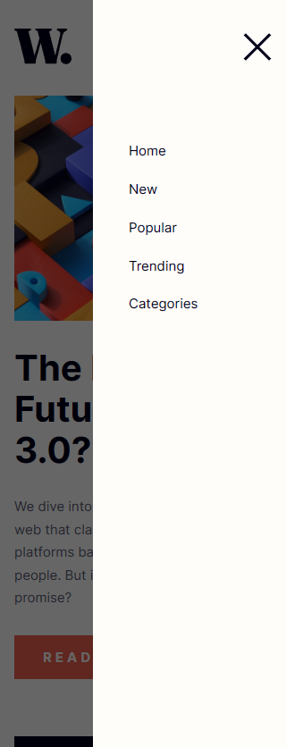
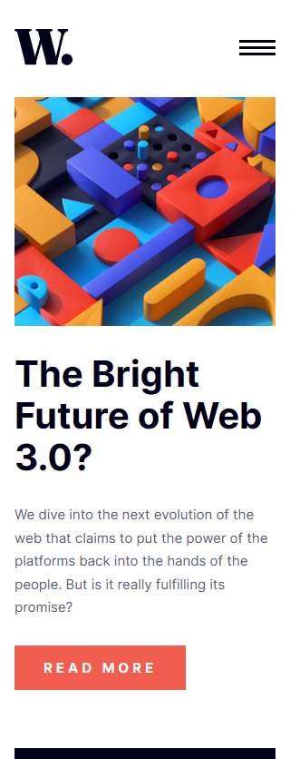

# Frontend Mentor - News homepage solution

This is a solution to the [News homepage challenge on Frontend Mentor](https://www.frontendmentor.io/challenges/news-homepage-H6SWTa1MFl). Frontend Mentor challenges help you improve your coding skills by building realistic projects.

## Table of contents

- [Overview](#overview)
  - [The challenge](#the-challenge)
  - [Screenshot](#screenshot)
  - [Links](#links)
  - [Built with](#built-with)
- [Author](#author)

**Note: Delete this note and update the table of contents based on what sections you keep.**

## Overview

### The challenge

Users should be able to:

- View the optimal layout for the interface depending on their device's screen size
- See hover and focus states for all interactive elements on the page

### Screenshot

.png>)

### Links

- Solution URL: [GitHub Repo](https://github.com/AhmedElbedfy/Frontend-Mentor/tree/main/news-homepage-main)
- Live Site URL: [Live site](https://ahmedelbedfy.github.io/Frontend-Mentor/news-homepage-main/)

### Built with

- Semantic HTML5 markup
- CSS custom properties
- Flexbox
- Mobile-first workflow
- BEM CSS architecture

## Author

- Frontend Mentor - [@ahmedelbedfy](https://www.frontendmentor.io/profile/ahmedelbedfy)
- Twitter - [@ahmedelbedfy](https://www.twitter.com/ahmedelbedfy)
- LinkedIn - [Ahmed Khaled](https://www.linkedin.com/in/ahmedelbedfy/)
